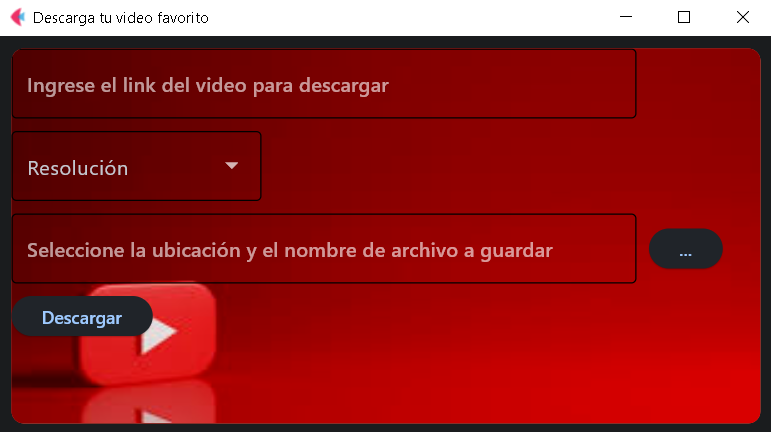

# Flet_Alpha_down_youtube
For download videos of youtube con Flet

### Español

# Aplicación de Descarga de Videos

Esta es una aplicación de Python que permite descargar videos de YouTube y guardarlos en tu computadora local. La aplicación tiene una interfaz gráfica de usuario (GUI) construida utilizando la biblioteca Flet (una biblioteca de GUI imaginaria en Python).

## Requisitos

- Python 3.x
- Bibliotecas requeridas: pytube, flet, ctypes, socket

## Instalación

1. Clona o descarga el repositorio a tu computadora.
2. Asegúrate de tener Python 3.x instalado.
3. Instala las bibliotecas requeridas ejecutando el siguiente comando en tu terminal o símbolo del sistema:

## Cómo usar la aplicación

1. Ejecuta el archivo `main.py` para iniciar la aplicación.
2. La aplicación mostrará una ventana con una interfaz gráfica.
3. Ingresa el enlace del video de YouTube que deseas descargar en el campo de texto "Ingrese el link del video para descargar".
4. Selecciona la resolución del video que deseas descargar en el menú desplegable "Resolución".
5. Haz clic en el botón "Seleccionar ubicación" para elegir la ubicación y el nombre del archivo en donde se guardará el video descargado.
6. Haz clic en el botón "Descargar" para iniciar la descarga del video.

Nota: Asegúrate de tener una conexión a Internet activa para descargar los videos de YouTube.

## Capturas de pantalla

## Contribuciones

Si deseas contribuir a este proyecto, siéntete libre de hacerlo. Abre un problema o envía una solicitud de extracción con tus mejoras o correcciones.

## Licencia

Este proyecto está bajo la Licencia MIT. Consulta el archivo LICENSE para obtener más detalles.

==================================================================================================================================================================
### English

Video Downloader Application
===========================

This is a Python application that allows you to download YouTube videos and save them to your local computer. The application has a graphical user interface (GUI) built using the Flet library (an imaginary GUI library in Python).

## Requirements
------------

- Python 3.x
- Required libraries: pytube, flet, ctypes, socket

## Installation
------------

1. Clone or download the repository to your computer.
2. Make sure you have Python 3.x installed.
3. Install the required libraries by running the following command in your terminal or command prompt:

How to Use the Application
--------------------------

1. Run the `main.py` file to start the application.
2. The application will display a window with a graphical interface.
3. Enter the YouTube video link you want to download into the text field "Enter the video link to download".
4. Select the video resolution you want to download from the dropdown menu "Resolution".
5. Click the "Select location" button to choose the location and file name where the downloaded video will be saved.
6. Click the "Download" button to start the video download.

Note: Make sure you have an active internet connection to download YouTube videos.

## Screenshots
-----------

## Contributions
-------------

If you would like to contribute to this project, feel free to do so. Open an issue or send a pull request with your improvements or fixes.

## License
-------
This project is licensed under the MIT License. See the LICENSE file for more details.

## Autor

Addrian A. Auvieux - aaauvieux@gmail.com

